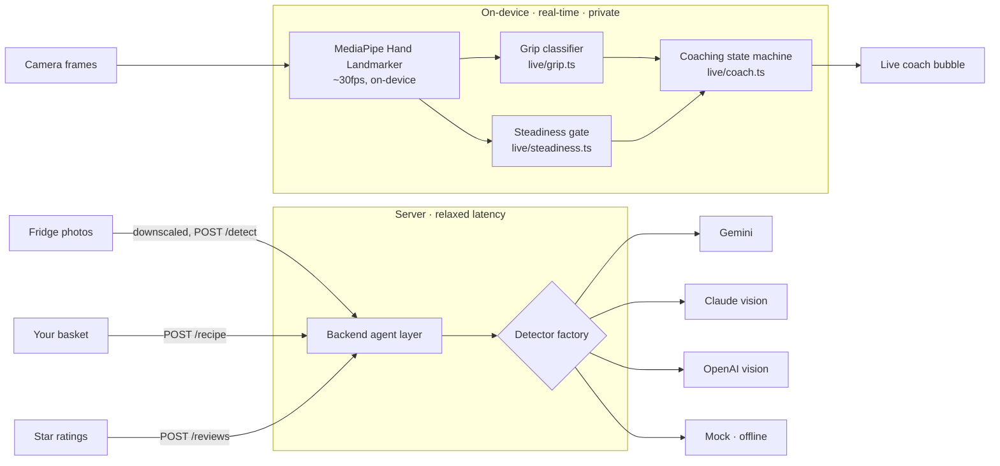

# Remy — a calm AI cooking coach

**Point your camera at the cutting board and Remy coaches your technique in real time, on-device — then helps you cook from what you already have.**

Remy watches your hands while you cook (grip safety, steadiness, step timing) entirely on-device, and uses a server only for the slow work: turning fridge photos into an ingredient inventory, generating a recipe from your basket, and post-cook feedback.


```
remy-mono/
├── backend/          Agent layer: image → inventory → recipe, + HTTP API (Node, Zod, zero-dep server)
└── frontend/
    ├── app/          Expo + React Native app (runs on web); the live CV coaching engine lives here
    └── website/      React + Vite marketing site (+ /live hand-tracking demo)
```

## Architecture



The split is deliberate: see [ADR 0002](docs/adr/0002-on-device-cv-vs-server.md). Detector swapping is one interface: [ADR 0001](docs/adr/0001-detector-abstraction.md).

## Hard problems I solved

1. **Metro can't bundle MediaPipe.** `@mediapipe/tasks-vision`'s `vision_bundle.mjs` uses `import(t.toString())`, which Metro's static analyzer rejects at bundle time. Fix: load the module from the jsdelivr CDN at runtime via a `Function`-indirected dynamic import so the bundler never sees it, and keep the npm package as a **types-only** dependency. The Vite website imports it normally. (`frontend/app/src/live/handLandmarker.ts`)

2. **Steadiness without flicker.** Raw landmark motion crosses any single threshold many times a second, so a naive "is it steady" check strobes. Fix: EMA-smoothed landmarks feeding a **hysteresis** gate — enter "steady" below 0.012 normalized units/frame, only leave above 0.022, with a 6-frame presence warm-up. (`frontend/app/src/live/steadiness.ts`)

3. **Grip safety from pure geometry.** Detecting the knuckle-guard ("claw") grip vs. dangerous extended fingers, from 21 landmarks, with no ML model: a finger is *curled* when its fingertip folds inside its PIP joint (closer to the wrist). ≥3 of 4 curled = guard, ≥3 extended = unsafe. Documented thresholds, unit-tested with synthetic + jittered fixtures. (`frontend/app/src/live/grip.ts`)

4. **Coaching that isn't a nag.** A state machine throttles non-safety tips to one per 45s, lets safety severity bypass the throttle (with per-phrase cooldowns so it doesn't strobe), rewards 60s of clean tracking with praise, never speaks while tracking is unstable, and filters phrases by the current step type — a chop correction can't fire during a stir. (`frontend/app/src/live/coach.ts`)

## Eval results

Grip classifier on 12 labeled landmark fixtures (`npm run eval:grip`):

```
class      precision  recall   f1     support
guard      1.00       1.00     1.00   4
extended   1.00       1.00     1.00   4
partial    1.00       1.00     1.00   4
overall accuracy: 100.0% (12/12)
```

Fixtures are synthetic (jittered canonical poses) today; recorded clips from real cooking sessions drop into the same `{label, hand}` format — that's the next data task.

## Tradeoffs & honest limits

- **On-device CV sees hands, not food.** It can't yet tell that the pan is boiling, so timed steps are inferred from step text and clearly labeled. Food/action recognition is a planned layer.
- **Ingredient detection** is wired to the backend `/detect`; with no API key it falls back to a deterministic mock, surfaced in the UI as a "sample scan," never silently.
- **Store deals/hours** on the Savings screen are sample data; the Google Maps links are real.
- **Native CV** isn't built — hand tracking is web-first; native shows a graceful fallback.

## What's next

- Record real grip clips and re-run the eval on true precision/recall.
- Wire native (Expo) MediaPipe so live coaching runs on phones.
- Food/action recognition so coaching reacts to the pan, not just the hands.
- Real grocery/flyer API behind the Savings screen.

## Run it

```bash
# Backend (mock detector — no key needed)
cd backend && npm install && npm run serve

# App on web
cd frontend/app && npm install && npm run web        # http://localhost:8082

# Website
cd frontend/website && npm install && npm run dev
```

Real detection: put `GEMINI_API_KEY`, `ANTHROPIC_API_KEY`, or `OPENAI_API_KEY` in `backend/.env`.

## Quality gates

```bash
# backend
cd backend && npm run typecheck && npm test                 # 30 tests

# app
cd frontend/app && npm run typecheck && npm test            # 35 tests
npm run eval:grip                                           # grip eval table
npm run e2e                                                 # Playwright happy path + downscale measurement

# website
cd frontend/website && npm run build
```

CI runs typecheck + tests + build for all three projects on every push: [.github/workflows/ci.yml](.github/workflows/ci.yml).
